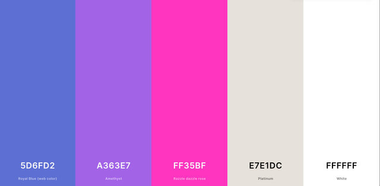

# Frostbite Studio Game Startup Website

The Frostbite Studios Website can be viewed on all devices to allow users to see who and what exactly Frostbite Game Studios is.

[View Frostbite Studios on Github Pages]()

## CONTENTS

- [User Experience (UX)](<#User-Experience-(UX)>)

  - [Initial Discussion](#Initial-Discussion)
  - [User Stories](#User-Stories)

- [Design](#Design)

  - [Colour Scheme](#Colour-Scheme)
  - [Typography](#Typography)
  - [Imagery](#Imagery)
  - [Features](#Features)
  - [Accessibility](#Accessibility)

- [Technologies Used](#Technologies-Used)

  - [Languages Used](#Languages-Used)
  - [Frameworks, Libraries & Programs Used](#Frameworks,-Libraries-&-Programs-Used)

- [Deployment & Local Development](#Deployment-&-Local-Development)

  - [Deployment](#Deployment)
  - [Local Development](#Local-Development)
    - [How to Fork](#How-to-Fork)
    - [How to Clone](#How-to-Clone)

- [Testing](#Testing)
  - [W3C Validator](#W3C-Validator)
  - [Solved Bugs](#Solved-Bugs)
  - [Known Bugs](#Known-Bugs)
  - [Testing User Stories](#Testing-User-Stories)
  - [Lighthouse](#Lighthouse)
    - [Index Page](#Index-Page)
    - [Books Page](#Books-Page)
    - [Contact Us Page](#Contact-Us-Page)
    - [Thank You Page](#Thank-You-Page)
  - [Full Testing](#Full-Testing)
- [Credits](#Credits)
  - [Code Used](#Code-Used)
  - [Content](#Content)
  - [Media](#Media)
  - [Acknowledgments](#Acknowledgments)

---

## User Experience (UX)

### Initial Discussion

Frostbite Studios is a Game Development Startup that develops games on all platforms for users from all age groups.

#### Key information for the site

- Who and what is Frostbite Game Studios?
- What platforms are the games created on?
- A way for people to find out about the companies games and play them.

### User Stories

#### Client Goals

- To make the website viewable from all electronic devices.
- To be able to inform everyone who Frostbite Studio is and give a good impression.
- To allow users to play games with no barriers.

#### First Time Visitor Goals

- I want to tell people who Frostbite Studio is and what they have to offer.
- I want to browse freely through the website without any barriers.
- I want to be able to follow their Social Media Platforms.

#### Returning Visitor Goals

- I want to find out about any new game releases and possible upcoming game updates.

#### Frequent Visitor Goals

- I want to be able to play the games and recommend them to other people.
- I want to be able to contact them at all times, should I have any questions.

---

## Design

### Colour Scheme

This website uses more of a neon color that are often used in more Cyberpunk-ish themes.

### Typography

The main Font used for this entire Website was 'Roboto'.

### Imagery

All images are taken from licence free stock photo website's which will be linked in the [credits](#Credits) section.

